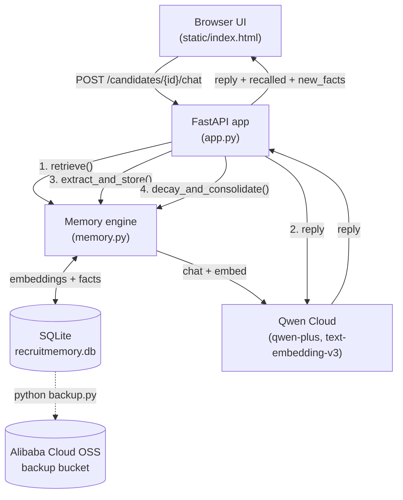

# RecruitMemory

An AI hiring assistant that **remembers candidates across interview sessions.**


Built for the **Global AI Hackathon Series with Qwen Cloud — Track 1: MemoryAgent.**

Interviewers at a jute mill (Jabbar Jute Mills) talk to candidates over multiple
sessions. RecruitMemory quietly extracts durable facts from each conversation,
recalls only the relevant ones later, and lets old details fade — so the
assistant behaves like a colleague who actually remembers people, not a chatbot
with amnesia.

<!-- Optional: add docs/screenshot.png and uncomment for a UI preview.
 -->

> 🎥 **Presenting?** See [DEMO.md](DEMO.md) for a 3-minute talk-track that shows all three memory mechanisms on screen.

---

## Why it fits the MemoryAgent track

The whole point of the track is an agent with a real memory system, not just a
long prompt. RecruitMemory implements **three distinct memory mechanisms**, each
its own function in [`memory.py`](memory.py):

| # | Mechanism | What it does | Where |
|---|-----------|--------------|-------|
| 1 | **Extraction** | Reads each interviewer message and pulls out structured candidate facts (`{fact, category, importance}`), embeds each one, and stores it. Skips near-duplicates so it doesn't re-learn what it already knows. | `extract_and_store()` |
| 2 | **Retrieval** | Embeds the current question and ranks every stored memory by `cosine similarity × decayed importance × recency`, injecting only the **top 5** into the prompt. Retrieving a memory "touches" it, keeping useful facts alive. | `retrieve()` |
| 3 | **Decay + Consolidation** | Importance halves every 14 days without access; faded memories are archived. When a candidate accumulates too many memories, the oldest/least-important batch is summarized into one memory to keep token usage bounded. | `decay_and_consolidate()` |

This mirrors how human memory works: you remember what's important and recent,
you forget trivia, and you compress old details into gist.

---

## Architecture



**One chat request does all three mechanisms in order:** retrieve relevant
memories → ask Qwen for a reply using them → extract new facts → run decay &
consolidation housekeeping.

### Stack
- **Backend:** FastAPI + uvicorn (Python 3.10)
- **AI:** Qwen Cloud via the OpenAI-compatible API — `qwen-plus` for chat,
  `text-embedding-v3` for embeddings
- **Storage:** SQLite (single file; embeddings stored as JSON)
- **Backup:** Alibaba Cloud OSS ([`backup.py`](backup.py))
- **Frontend:** single hand-built HTML page, Tailwind (CDN) + Hugeicons — no build step
- **Deploy:** one Docker container ([`Dockerfile`](Dockerfile), [`docker-compose.yml`](docker-compose.yml))

---

## Setup

### 1. Configure secrets
Copy the example env file and fill in your keys:
```bash
cp .env.example .env
```
Edit `.env`:
```
QWEN_API_KEY=your-qwen-key
QWEN_BASE_URL=https://dashscope-intl.aliyuncs.com/compatible-mode/v1
QWEN_CHAT_MODEL=qwen-plus
QWEN_EMBED_MODEL=text-embedding-v3

# Optional — only needed for cloud backups (backup.py)
OSS_ACCESS_KEY_ID=
OSS_ACCESS_KEY_SECRET=
OSS_BUCKET=
OSS_ENDPOINT=https://oss-ap-southeast-1.aliyuncs.com
```

### 2a. Run with Docker (recommended)
```bash
docker compose up --build
```
Open **http://localhost:8000**. Stop with `docker compose down`.

### 2b. Or run locally with Python
```bash
python -m venv .venv
source .venv/bin/activate
pip install -r requirements.txt
uvicorn app:app --reload
```
Open **http://localhost:8000**.

### 3. Back up to the cloud (optional)
```bash
python backup.py          # upload a timestamped copy to OSS
python backup.py restore  # pull the newest backup back down
```

---

## API

| Method | Path | Purpose |
|--------|------|---------|
| `POST` | `/candidates` | Create a candidate `{name, role}` |
| `GET`  | `/candidates` | List candidates |
| `POST` | `/candidates/{id}/chat` | Chat — recalls memories, replies, extracts new facts |
| `GET`  | `/candidates/{id}/memories` | Inspect stored memories (for the demo) |

---

## Try it

1. Create a candidate, e.g. **Karim** (role: *Loom Operator*).
2. Tell it facts across separate messages:
   *"Karim has 5 years on jute looms."* … *"He scored 8/10 on the safety test."*
3. Ask later: *"Is Karim a good fit for a senior loom role?"* — it recalls the
   relevant facts and answers with them. Watch the newly-extracted facts appear
   as pills under your message.

---

## License

MIT — see [LICENSE](LICENSE).
