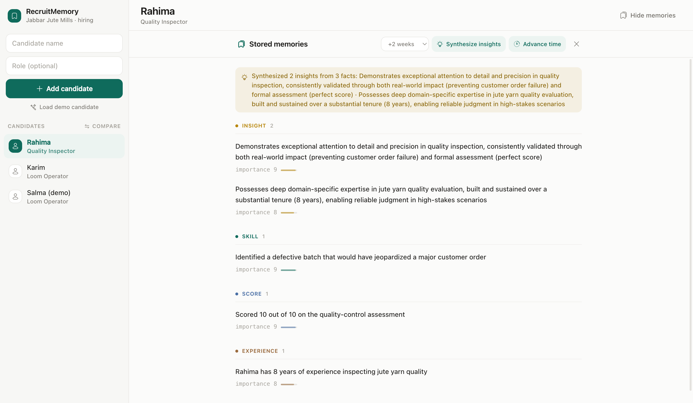
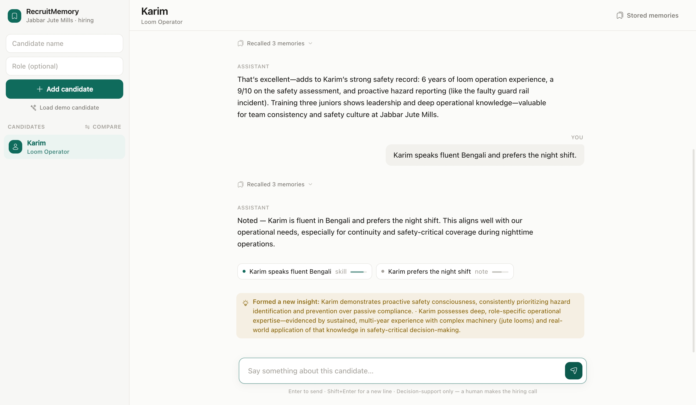
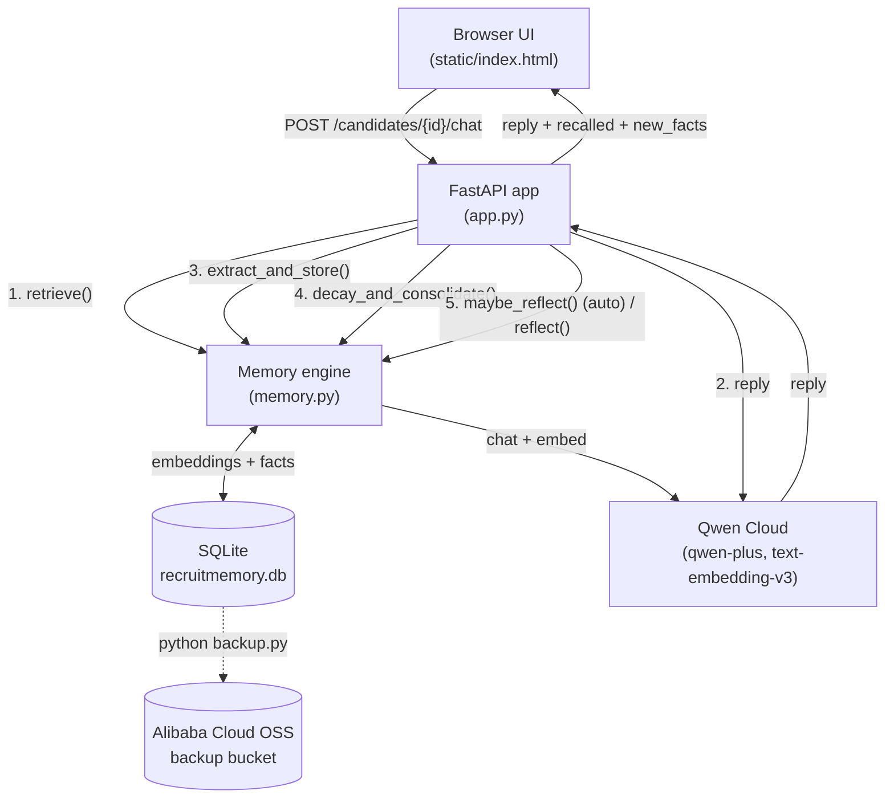

# RecruitMemory

An AI hiring assistant that **remembers candidates across interview sessions.**


Built for the **Global AI Hackathon Series with Qwen Cloud, Track 1: MemoryAgent.**

**Live demo: https://47.237.178.111.sslip.io** (hosted on Alibaba Cloud ECS,
Singapore; https so the live interview microphone works). Click "Load demo
candidate" under Demo tools in the sidebar, or add your own.

Interviewers at a jute mill (Jabbar Jute Mills) talk to candidates over multiple
sessions. RecruitMemory quietly extracts durable facts from each conversation,
recalls only the relevant ones later, lets old details fade, changes its mind
when you correct it, and **synthesizes higher-order insights** the facts only
imply, so the assistant behaves like a colleague who actually understands
people, not a chatbot with amnesia.

**Not a database-backed chatbot:** it *forgets* on a decay curve, *retires*
beliefs you overturn, and *forms opinions it was never told*. See the numbers in
[Does the memory actually work?](#does-the-memory-actually-work). Every claim
below is measured in [`eval.py`](eval.py).



> 🎥 **Presenting?** See [DEMO.md](DEMO.md) for a 3-minute talk-track that shows every memory mechanism on screen.

---

## Why it fits the MemoryAgent track

The whole point of the track is an agent with a real memory system, not just a
long prompt. RecruitMemory implements **four distinct memory mechanisms**, each
its own function in [`memory.py`](memory.py):

| # | Mechanism | What it does | Where |
|---|-----------|--------------|-------|
| 1 | **Extraction + belief update** | Reads each interviewer message and pulls out structured candidate facts (`{fact, category, importance}`), embeds each one, and stores it. Skips near-duplicates, and when a new fact *corrects* an old one (e.g. safety score 6→9), it **retires the stale belief** instead of hoarding both, so retrieval never surfaces a contradiction. | `extract_and_store()` |
| 2 | **Retrieval** | Embeds the current question and ranks every stored memory by a weighted sum of `relevance + importance + recency` (Generative Agents, Park et al. 2023), injecting only the **top 5** into the prompt, so cost stays flat as history grows. Retrieving a memory "touches" it, keeping useful facts alive. | `retrieve()` |
| 3 | **Decay + Consolidation** | Importance halves every 14 days without access; faded memories are archived (a low-value fact is forgotten in ~a week, a critical one survives a month+). When a candidate accumulates too many memories, the oldest/least-important batch is summarized into one to keep token usage bounded. | `decay_and_consolidate()` |
| 4 | **Reflection** | **Fires automatically as facts accumulate** (and on demand): reads the raw facts and synthesizes one or two **higher-order insights** (durable traits no single fact states, such as "consistent safety ownership") stored as high-importance memories that then influence future retrieval and recommendations. This is how the agent's *understanding deepens over time* rather than just accumulating. | `maybe_reflect()` / `reflect()` |

This mirrors how human memory works: you remember what's important and recent,
you forget trivia, you compress old details into gist, and you form judgements
that no single observation ever stated.



*Reflection firing **automatically**: after a few facts about Karim accrue, the
agent synthesises traits no single message stated ("proactive safety
consciousness", "deep operational expertise") with no button pressed. That's
understanding deepening in real time, not just facts piling up.*

---

## From typed notes to live interviews

RecruitMemory originally learned facts one way: the recruiter typed a debrief
into the chat after the interview. It now **listens to the interview itself**.
A consent-gated recorder captures microphone audio in the browser, slices it
into 6-second chunks that each begin with 1.5 seconds of the previous chunk
(so words spoken right at a chunk boundary are never cut in half; the server
drops the repeated words), transcribes each chunk with **`qwen3-asr-flash`** (Qwen's
speech recognition model, called through the same OpenAI-compatible API as chat
and embeddings), and pipes the words into the *same* extraction, dedup, and
belief-update pipeline that typed notes use. Facts appear on screen as the
candidate is still talking.

Why this matters:

- **Less recruiter friction.** No typing during or after the interview; the
  debrief writes itself.
- **More complete and consistent capture.** The transcript catches details a
  tired interviewer would forget to write down, and every interview is captured
  the same way.
- **The memory engine underneath is unchanged.** Extraction takes text and does
  not care whether a human typed it or a microphone heard it, demonstrating the
  architecture was input-source-agnostic from the start. Manual note entry
  still works in the chat for interviews without a laptop present.

Privacy is handled explicitly: recording can only start after the interviewer
confirms the candidate has been informed, and that **consent confirmation
timestamp is stored on the interview record** (an interview row cannot exist
without one). The full timestamped transcript is kept with the record for
auditability.

The chat box is now the **query tool**: ask about one candidate, or select
**All candidates** in the sidebar to search every stored memory at once
("Which candidates scored best on communication?"), with every answer citing
which candidate each fact came from.

> Note: browsers only allow microphone access on `localhost` or `https` pages.

### Resume pre-load: memory starts before the interview does

Before the interview, the recruiter can upload the candidate's **resume or
portfolio** (PDF or plain text). The agent reads it, runs the text through the
same extraction pipeline, stores each fact tagged `source: resume`, and drafts
**5-8 interview questions anchored to what the document actually claims** (a
resume that mentions loom maintenance gets a question probing depth on loom
maintenance, not "tell me about yourself"). The questions sit on the
candidate's record and ride along as a glanceable reference panel during the
live recording. A typed note field also stays available *while* the mic is
recording, for things a microphone cannot capture: the candidate arrived late,
showed a physical certificate, a gut impression.

The point for architecture quality: **memory can be seeded from multiple
sources, resume, live interview, and manual notes, all flowing into the same
retrieval and decay system.** Every memory carries its source, so "what do we
know about Karim" draws on resume facts and interview facts together, and
"where did this come from" has an honest answer.

---

## Does the memory actually work?

A memory agent should be *measured*, not just asserted. [`eval.py`](eval.py) runs
five probes against the real pipeline (real Qwen embeddings, a throwaway DB):

| Probe | What it tests | Result |
|-------|---------------|--------|
| **A. Retrieval** | Ask questions phrased differently from the stored facts. Is the right memory in the injected top-5? | **recall@5 = 100%**, recall@3 = 75%, MRR = 0.65 (8 probes) |
| **B. Ranking ablation** | On stale-but-similar distractors, how often does the ranking recover the *current* truth vs plain vector search? | **full ranking 5/5** vs cosine-only 2/5 |
| **C. Belief update** | A correction should retire the old belief, keep the new one. | **3/3** |
| **D. Forgetting** | A low-value memory should fade out while a high-value one survives the same elapsed time. | **3/3** |
| **E. Reflection** | Synthesized insights should be stored *and* surface for trait-level questions. | **passes**, insight retrieved over raw facts |

The ablation (B) is the headline: adding the importance + recency terms recovers
the current truth **2.5× more often** than similarity alone, proof the ranking
earns its keep. (recall@1 is lower by design, because the system injects the
**top 5**, not the top 1, so recall@5 is the metric that maps to what the prompt
actually sees.) Reproduce with `python eval.py` (needs a working `QWEN_API_KEY`).

```
A. RETRIEVAL   recall@1=50%  recall@3=75%  recall@5=100%  MRR=0.65  (n=8)
B. ABLATION    full ranking recovered current truth 5/5  vs plain cosine 2/5
C. BELIEF UPD  old belief retired, new kept: 3/3
D. FORGETTING  low-value archived, high-value survived: 3/3
E. REFLECTION  insights created=2  stored_ok=True  influences_retrieval=True
```

*One representative run. Small variation is expected with model sampling (e.g.
reflection yields 1 or 2 insights); recall@5 was 100% in our runs.*

---

## Architecture



**One chat request runs the core loop in order:** retrieve relevant memories →
ask Qwen for a reply using them → extract new facts (with belief-update) → run
decay & consolidation housekeeping → **reflect automatically** once enough new
facts have accrued. The same reflection is also available on demand (the
"Synthesize insights" button / `POST /reflect`).

**On scaling:** retrieval ranks a *single candidate's* memories, naturally tens,
not millions (decay + consolidation keep the count bounded on purpose), so the
linear scan is not the bottleneck a global vector store would be. If a candidate's
history ever grew large, the ranking is a drop-in for an ANN index (e.g.
`sqlite-vec`); the [`eval.py`](eval.py) harness is already in place to prove such a
swap doesn't regress recall.

### Stack
- **Backend:** FastAPI + uvicorn (Python 3.10)
- **AI:** Qwen Cloud via the OpenAI-compatible API: `qwen-plus` for chat,
  `text-embedding-v3` for embeddings, `qwen3-asr-flash` for live interview
  transcription
- **Storage:** SQLite (single file; embeddings stored as JSON)
- **Backup:** Alibaba Cloud OSS ([`backup.py`](backup.py))
- **Frontend:** single hand-built HTML page, Tailwind (CDN) + Hugeicons, no build step
- **Deploy:** one Docker container ([`Dockerfile`](Dockerfile), [`docker-compose.yml`](docker-compose.yml))

---

## Setup

### 1. Configure secrets
Copy the example env file and fill in your keys:
```bash
cp .env.example .env
```
Edit `.env`:
```
QWEN_API_KEY=your-qwen-key
QWEN_BASE_URL=https://dashscope-intl.aliyuncs.com/compatible-mode/v1
QWEN_CHAT_MODEL=qwen-plus
QWEN_EMBED_MODEL=text-embedding-v3
QWEN_ASR_MODEL=qwen3-asr-flash

# Optional, only needed for cloud backups (backup.py)
OSS_ACCESS_KEY_ID=
OSS_ACCESS_KEY_SECRET=
OSS_BUCKET=
OSS_ENDPOINT=https://oss-ap-southeast-1.aliyuncs.com
```

### 2a. Run with Docker (recommended)
```bash
docker compose up --build
```
Open **http://localhost:8000**. Stop with `docker compose down`.

### 2b. Or run locally with Python
```bash
python -m venv .venv
source .venv/bin/activate
pip install -r requirements.txt
uvicorn app:app --reload
```
Open **http://localhost:8000**.

### 3. Back up to the cloud (optional)
```bash
python backup.py          # upload a timestamped copy to OSS
python backup.py restore  # pull the newest backup back down
```

---

## API

| Method | Path | Purpose |
|--------|------|---------|
| `POST` | `/candidates` | Create a candidate `{name, role}` |
| `GET`  | `/candidates` | List candidates |
| `POST` | `/candidates/{id}/chat` | Ask (`mode:"ask"`, read-only) or note (`mode:"note"`, also extracts facts) |
| `GET` | `/candidates/{id}/interviews` | Past interview sessions with transcripts and consent timestamps |
| `POST` | `/candidates/{id}/reflect` | Synthesize higher-order insights from the raw facts |
| `GET`  | `/candidates/{id}/memories` | Inspect stored memories (live decayed strength) |
| `POST` | `/candidates/{id}/interviews` | Start a live interview (requires `{"consent_confirmed": true}`; logs the timestamp) |
| `POST` | `/interviews/{id}/audio` | Transcribe a ~6s WAV chunk (`{"audio_b64"}`) and extract facts from it |
| `POST` | `/interviews/{id}/end` | End the interview: flush, decay, reflect, return the transcript |
| `POST` | `/candidates/{id}/notes` | Typed note (works mid-recording), extraction only, tagged `manual_note` |
| `POST` | `/candidates/{id}/resume` | Pre-load memory from a resume (`{"file_b64", "filename"}`, PDF/.txt) and draft tailored questions |
| `POST` | `/ask` | Ask a question across ALL candidates' memories (query-only) |

---

## Try it

1. Create a candidate, e.g. **Karim** (role: *Loom Operator*).
2. Press **Record interview**, confirm the consent prompt, and speak as if
   interviewing: *"Karim has 5 years on jute looms. He scored 8 out of 10 on
   the safety test."* Watch the transcript scroll on the left and the extracted
   facts slide in on the right. End the interview: the new memories and the
   full transcript (with the logged consent time) are now on Karim's page.
   (No microphone handy? Switch the composer to **Note** and type the same
   facts instead.)
3. Ask later, in **Ask** mode: *"Is Karim a good fit for a senior loom role?"*
   It recalls the relevant facts and answers with them; asking never stores
   anything. Then click **All candidates** and ask *"Who scored best on
   safety?"* to query across everyone at once, or tick two candidates there to
   weigh them side by side.

---

## Responsible use & limitations

Hiring is a high-stakes, legally sensitive domain, so RecruitMemory is built as
**decision-support, not a decision-maker**:

- **A human makes the hiring call.** The assistant surfaces and weighs remembered
  facts; it never issues an autonomous hire/reject verdict. This is stated in the
  UI on every screen.
- **Recording is consent-gated.** The microphone cannot start until the
  interviewer confirms the candidate has been informed, and that confirmation
  timestamp is stored on the interview record alongside the transcript.
- **Every recommendation is auditable.** The exact memories behind any answer are
  shown (the "recalled" list and the Compare evidence columns), no black-box scores.
- **Memories are inspectable and deletable.** You can view a candidate's full
  memory store and delete a candidate (and all their memories) at any time, so
  there is a clear path to correct or erase what the system holds.
- **No protected attributes.** Extraction and reflection are prompted to capture
  only job-relevant facts and to avoid inferring protected characteristics; a
  reviewer should still check memories for proxy bias before relying on them.
- **Insights are inferences, not observations.** The higher-order insights the
  agent synthesizes are its *own* generalizations from the facts, hypotheses to
  verify, not established truths. They live in a distinct, clearly-labelled
  category and are auditable and deletable like any other memory, so a reviewer
  can always separate what was *observed* from what the agent *inferred*.
- **Fictional data.** The jute-mill scenario and all candidates are illustrative;
  the project ships with no real personal data.

RecruitMemory is a demonstration of memory-agent techniques, not a production
hiring system. A real deployment would need bias auditing, access controls, and
compliance review.

---

## License

MIT. See [LICENSE](LICENSE).
